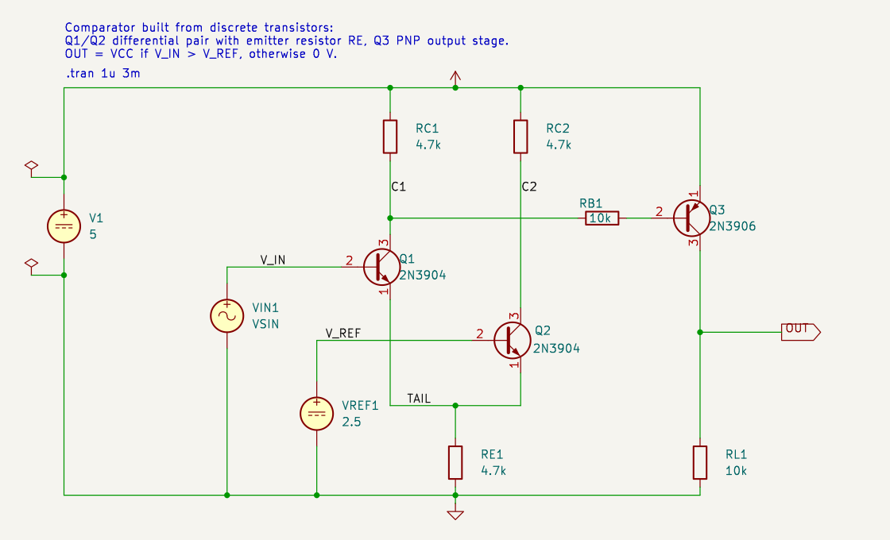
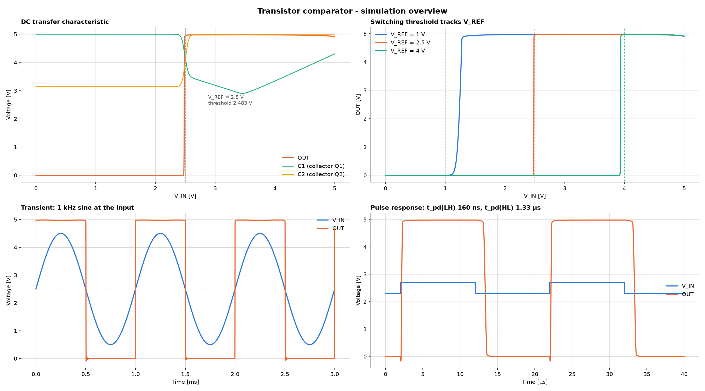

# Transistor comparator (SKiDL → KiCad → ngspice)

[](https://doi.org/10.5281/zenodo.22965438)

Release v1.0.0 is archived on Zenodo: DOI [10.5281/zenodo.22965438](https://doi.org/10.5281/zenodo.22965438)
(concept DOI for all versions: [10.5281/zenodo.22965437](https://doi.org/10.5281/zenodo.22965437)).

A simple comparator built from discrete bipolar transistors, no op-amp:

* **Q1/Q2 (2N3904)** – NPN differential pair, common emitter resistor RE (≈ 0.4 mA tail current)
* **RC1/RC2** – collector resistors
* **Q3 (2N3906)** – PNP output stage, base driven through RB from Q1's collector, load resistor RL

`OUT = VCC` if `V_IN > V_REF`, otherwise `OUT = 0 V`.



The schematic was generated from the SKiDL description and then re-arranged
by hand in KiCad for readability (KiCad also re-annotated some references,
e.g. `VREF` → `VREF1`). The connectivity was verified afterwards against the
SKiDL netlist and the simulation results are unchanged. Re-running
`komparator.py` would regenerate the automatic layout and discard the manual
placement.

## Files

| File | Content |
|---|---|
| `komparator.py` | **SKiDL description** of the circuit, component values, SPICE models, schematic layout. Generates netlist, schematic and SPICE netlist. |
| `kicad_sch.py` | Writer that turns the SKiDL circuit + placement into a `.kicad_sch` (incl. Sim.* fields for the KiCad simulator) |
| `ngspice.py` | ctypes wrapper around `libngspice.so` (no PySpice needed) |
| `simulate.py` | **Simulation** of a given `.kicad_sch`: exports the netlist with `kicad-cli`, runs DC transfer, threshold vs. V_REF, transient (sine, pulse) → table + Matplotlib figures |
| `komparator.kicad_sch` / `.kicad_pro` | generated KiCad project, runs directly in the KiCad simulator (`.tran 1u 3m` is placed as text in the sheet) |
| `komparator.net` | KiCad netlist from SKiDL |
| `komparator.cir` | SPICE netlist derived from the SKiDL circuit |
| `pyproject.toml` / `uv.lock` | dependencies for `uv run` |
| `docs/schematic.png` | rendering of the hand-arranged schematic |
| `docs/falstad.txt` / `docs/falstad_url.txt` | the same circuit for the [Falstad circuit simulator](https://www.falstad.com/circuit/) (import via *File → Import From Text*, or open the link) |
| `results/` | `summary.md`, the simulated netlist, raw CSV data, PNG figures and `overview.png` (all plots on one canvas) |

## Usage

```bash
uv run komparator.py                          # generate netlist + schematic, verify consistency with kicad-cli
uv run simulate.py komparator.kicad_sch       # simulate the schematic, print table, write figures to results/
uv run simulate.py komparator.kicad_sch --show   # additionally open the figures tiled across the screen
```

`uv run` creates the virtual environment from `pyproject.toml`/`uv.lock` on
first use. The simulation takes the schematic as its argument, exports it
with `kicad-cli` and reads supply, reference and tail resistor values from
that netlist, so a schematic edited in KiCad is simulated exactly as drawn
(`--results DIR` selects the output directory).

Requirements: [uv](https://docs.astral.sh/uv/), Python ≥ 3.10, KiCad 9/10
(symbol libraries in `/usr/share/kicad/symbols`, `kicad-cli`), `libngspice.so.0`.

Note: `komparator.py` regenerates `komparator.kicad_sch` from the SKiDL layout
and overwrites manual placement changes.

`komparator.py` re-exports the generated schematic with `kicad-cli` as a SPICE
netlist and compares its connectivity with the SKiDL circuit. The message
`Schematic <-> SKiDL netlist: IDENTICAL` confirms that schematic and simulation
describe the same circuit.

## Interactive version (Falstad)

The circuit is also available for the browser-based Falstad simulator, with
scopes on V_IN and OUT:
[open in Falstad](https://www.falstad.com/circuit/circuitjs.html?ctz=CQAgjCAMB0l3BWcMBMcUHYMGZIA4UA2ATmIxAUgpABZsKBTAWjDACgAlcYlEYw7r0I0oomlSRUp0BGwBOgvgLA9whKbQxw2Ad0Vh1+jAMhsALmqore1xVajQTj5Ka7Y0SkO6rDRVcdQaMLIK3p5hBho0WqZ6EYYRxlDmXgg2qhGq9jBOytp6tmh4iigBsV4eRRVUpVK6JQFhtckKKAgCzW0CuCL+MWwA5iBdXpAiI2F1AG6emLz8duAuNcMyfjL1C7aRdoOzGPMdeMV1cWmK2ITFtuWX1xlXw6XJbo8oz3fD7X60NWtBGwKqh2IMM5VBVgSvHBUNoBgqyT0NHh7jhyiy8jRihovhuy1MFhxIlsNC2WRALAcuRcnFoWySpOUNF6YgkP2C9UZw3wdI6ZUxXOaXJ6ojA8FMQ2FY151T8nIWzQQzOG-IAHhRzqUkAg8DUaMViSIAPIAVQAKmx1WKrLrwLhwHh6IaQAA1AD6AEkAHKWry2zD+So4WjgETujgAUQAYr60D49T4neBeC6AMKp2Niu0Ju1JsC8Dip9jq7DYa72z5gUsh-MgQsoWMYcYYJC4GoYA3JusR310G3+b5gR01gsAIV9CDAze1AUwndrHAAMrG4NzfjU8yIi2wAPZ2kC+fyQYjFSTQCBWXfDciH34nwLnpbsIA)

## Results (see `results/summary.md`)

At V_REF = 2.5 V the output switches at ≈ 2.48 V with a transition width of
only ~6 mV (gain ≈ 770 V/V). Propagation delay L→H is ~160 ns, H→L ~1.3 µs
because Q3 saturates and its storage time dominates. At a low V_REF (1 V)
the tail current drops sharply and the offset grows to ~240 mV; a current
mirror instead of RE would fix that.



## License

This work is licensed under the [Creative Commons Attribution 4.0 International License](https://creativecommons.org/licenses/by/4.0/) (CC BY 4.0). See `LICENSE`.
